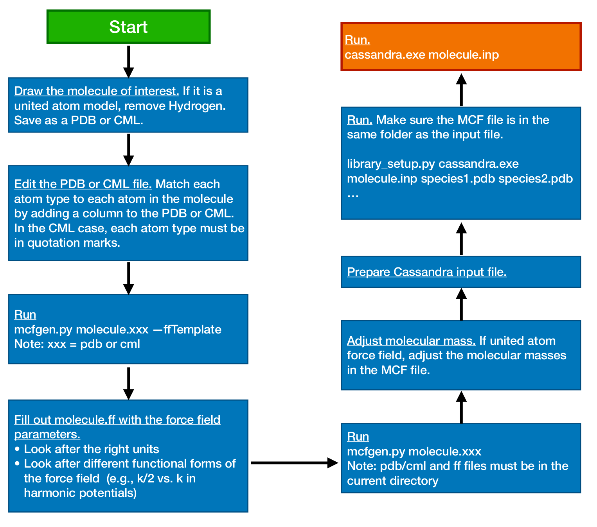

.. This file contains information on how to set up a Cassandra simulation
   Wrtten by Jindal Shah on 02/09/12
   Updated by Ed Maginn on 03/20/14
   Updated by Ed Maginn on July 27, 2014

.. _basics:

Cassandra Basics
================

Flow Diagram
~~~~~~~~~~~~

A flow diagram that overviews the setup for a Cassandra simulation is displayed
in :numref:`fig_flowdiag`.  This diagram employs two automation scripts located
in the ``/Scripts/`` directory: ``mcfgen.py`` and ``library_setup.py``.  These
scripts are particularly useful when simulating large molecules.  For details
about how to use them, please refer to sections sec:mcfgen and sec:libgen of
this user guide, and to the README files located in the subdirectories inside
the directory ``/Scripts/``.

.. _fig_flowdiag:

    Flow diagram representing a typical setup of a Cassandra simulation

Cassandra Simulation Setup
~~~~~~~~~~~~~~~~~~~~~~~~~~

Once a system is identified, setting up a Cassandra simulation from
scratch requires preparation of the following files.

* A molecular connectivity file (MCF) (``*.mcf``) containing the
  molecular connectivity information on bonds, angles, dihedrals,
  impropers and whether the molecule is composed of fragments.
  For information on the MCF file, please refer to :ref:`sec:mcf_file`.
* An input file (``*.inp``) (see :ref:`sec:input_file`)
* If the molecule is composed of fragments, then a fragment library
  file for each of the fragments is required. For instructions on
  how to generate these files, please refer to :ref:`sec:libgen`.

MCF files for united-atom models of methane, isobutane, dimethylhexane,
cyclohexane and diethylether are provided in the ``MCF`` directory. Input
files for NVT, NPT, GCMC and GEMC ensembles are located in the ``Examples``
directory which also contains fragment library files for a number of molecules
simulated in these ensembles.

Cassandra File Preparation
~~~~~~~~~~~~~~~~~~~~~~~~~~

MCF File
--------

One MCF file is required for each unique species in a simulation. A species is
defined as a collection of atoms associated with each other through bonds. Thus
a molecule is a species as is an ion. If you wanted to simulate sodium sulfate,
you would need separate MCF files for the sodium ion and the sulfate ion. MCF
files can be created manually or by using the scripts provided with the code, as
described in the section :ref:`sec:mcfgen`. Instructions for generating an MCF
file can also be found in the ``Scripts/MCF_Generation/README`` file.

.. We will collect MCF files submitted to us by users and will post them on the
   Cassandra website `<https://cassandra.nd.edu>`_. If you have an MCF file you
   would like us to post, send it to ed@nd.edu.

Input File
----------

An input file is required for a Cassandra simulation. The input file specifies
conditions for the simulation and various keywords required for the simulation
in a given ensemble. Please refer to :ref:`sec:input_file` for further
details.

Fragment Library Generation
---------------------------

Cassandra makes use of reservoir sampling schemes to correctly and efficiently
sample the various coupled intramolecular degrees of freedom associated with
branch points and rings. For more information, please see Ref. \cite{Shah:2011}.
The molecule is decomposed into fragments that are either branch points or ring
groups, each coupled to other fragments via a single dihedral angle. Thus, the
total number of fragments of a molecule is the sum of branch points and ring
groups in the molecule. The neighboring fragments are connected by two common
atoms present in each of the fragments. Note that the ring group contains all
the ring atoms and those directly bonded to the ring atoms. For each fragment
identified, Cassandra runs a pre-simulation in the gas phase to sample the
intramolecular degrees of freedom. A library of a large number of these
conformations are stored for use in an actual simulation.

The gas phase library generation has been automated with the script
``library_setup.py`` located in the ``Scripts/Frag_Library_Setup``
directory. Use the following command for generating the fragment library::

    python $PATH/Frag_Library_Setup/library_setup.py $PATH/Src/cassandra_executable input_filename mol1.pdb (mol1.cml)  mol2.pdb (mol2.cml) ...}

where ``input_filename`` is the name of the input file for the actual simulation
and ``mol1.pdb mol2.pdb ...`` or ``mol1.cml mol2.cml ...}`` correspond to the
names of the pdb (or cml) files used to generated the MCF files. Make sure that
if a file does not exist in the current working directory, its path relative to
the current working directory is specified.

Running a Simulation
~~~~~~~~~~~~~~~~~~~~

To launch a Cassandra simulation, run the following command::

    cassandra_executable input_filename

The executable will read ``input_filename`` and execute the instructions.  Make
sure that the required files (MCF, fragment library files) are located in the
directories as given in the input file.

Restarting a Simulation
~~~~~~~~~~~~~~~~~~~~~~~

Restarting a simulation requires either a checkpoint file (``*.chk`` produced by
Cassandra) or a configuration file obtained from xyz files generated from a
previous simulation. Please refer to :ref:`sec:start_type` to find
information about the keywords ``checkpoint`` and ``read_config``.

Cassandra Output Files
~~~~~~~~~~~~~~~~~~~~~~

Cassandra generates several output files which can be used for later analysis.
All have as a prefix the ``Run_Name`` specified in the input file.
See :ref:`sec:run_name` for details. The type of output is specified by the
file name suffix. The following are generated:

* **Log file** (``*.log``): Contains basic information on what the run is,
  timing information and reports the various parameters specified by the user. A
  complete copy of the input file is reproduced. Other important information
  includes the move acceptance rates. You can use the log file to keep track of
  what conditions were simulated.

* **Coordinate file** (``*.xyz`` or ``*.box#.xyz``): For each box in the
  system, a set of xyz coordinates are written out with a frequency specified by
  the user (``Coord_Freq``). The file has as a header the number of atoms in the
  box. Following this, the atomic coordinates of molecule 1 of species 1 are
  written, then the coordinates of molecule 2 of species 1 are written, etc.
  After all the coordinates of the molecules of species 1 are written, the
  coordinates of the molecules of species 2 are written, etc. You can use this
  file to do all your structural analysis and post processing.

.. note::
    Note that if you generate your initial configuration using the ``make_config``
    command, the first ''snapshot'' of the coordinate file will contain the initial
    configuration of all the species in the system for a given box. You can use this
    configuration to check on whether the initial configuration is reasonable, or
    use it as an input to other codes. Note that the initial configuration will be
    generated using a configurational biased scheme,  so it may be a better starting
    configuration than if you used other methods.

* **Checkpoint file** (``*.chk``): A checkpoint file is written every
  ``Coord_Freq`` steps. This can be used to restart a simulation from this point
  using all of the same information as the run that was used to generate the
  checkpoint file. To do this, you must use the checkpoint restart option (see
  :ref:`sec:start_type`. It will basically pick up where the simulation
  left off, using the same random number seed, maximum displacements, etc. This
  is useful in case your job crashes and you want to continue running a job. You
  can also use the checkpoint file to start a new simulation using the
  configuration of the checkpoint file as an initial configuration and the
  optimized maximum displacements.  To do this, use the script ``read_old.py``. You
  will need to set a new random number seed if you do this. See the
  documentation in :ref:`sec:seeds` for more details.

* **H-matrix file** (``*.H`` or ``*.box#.H``): This file is written to every
  ``Coord_Freq`` MC steps. The first line is the box volume in angstrom\ :sup:`3`. The
  next three lines are the box coordinates in angstrom in an H-matrix form.
  Since Cassandra only supports cubic boxes at the moment, this is just a
  diagonal and symmetric matrix, but is included here for later versions that
  will enable non-orthogonal boxes. After this, a blank line is written. The
  next line is the box number, and the final line(s) is(are) the species ID and
  number of molecules for that species in this box. If there are three species,
  there will be three lines. This output is repeated every ``Coord_Freq`` times.
  This file allows you to compute the density of the box during constant
  pressure simulations.

* **Property file** (``*.prp#`` or ``*.box#.prp#``): This file lists the
  instantaneous thermodynamic and state properties for each box. Note that you
  can have more than one property file (hence the # after 'prp') and more than
  one box (also why there is a # after 'box'). The user specifies which
  properties are to be written and in what order, and these are then reproduced
  in this file. The file is written to every ``Prop_Freq`` steps. A header is
  written to the first two lines to designate what each property is. You may use
  this file to compute thermodynamic averages.

