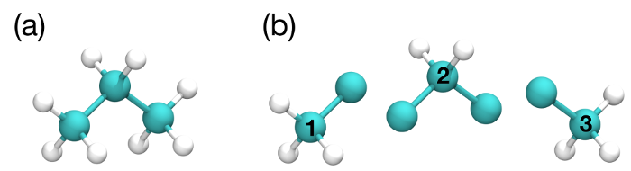

Metropolis Acceptance Criteria
------------------------------

Monte Carlo moves implemented in Cassandra preserve detailed
balance between each pair of microstates :math:`m` and :math:`n`

.. math::
   \Pi_{mn}\ \alpha_{mn}\ p_m = \Pi_{nm}\ \alpha_{nm}\ p_n
   :label: detailed_balance

where :math:`\Pi_{mn}` is the probability of accepting the move from
microstate :math:`m` to microstate :math:`n`, :math:`\alpha_{mn}` is the
probability of attempting the move that will form :math:`n` from
:math:`m`, and :math:`p_m` is the probability of :math:`m` in the
ensemble of interest.

In Cassandra, detailed balance is enforced via the Metropolis criterion

.. math::
   \Pi_{mn} = \min\left(1, \frac{\alpha_{nm}}{\alpha_{mn}} \frac{p_n}{p_m} \right)
   :label: eq:metropolis

The ratio in Eq. :eq:`eq:metropolis` will often
involve an exponential, e.g. :math:`e^{-\beta \Delta U}`. To preserve
precision in the energy calculation, the acceptance probability is
computed

.. math::
   \Pi_{mn} = \exp\left\{-\max\left[0, \ln\left(\frac{\alpha_{mn}}{\alpha_{nm}} \frac{p_m}{p_n}\right)\right]\right\}
   :label: eq:metropolis_2

The logarithm, defined in code as ``ln_pacc``, is tested in the function
``accept_or_reject()`` which is defined in file ``accept_or_reject.f90``.
If ``ln_pacc`` is greater than 0 and less than a maximum numerical value,
:math:`\Pi_{mn}` is computed and compared to a random number.

::

     accept_or_reject = .FALSE.
     IF (ln_pacc <= 0.0_DP) THEN
        accept_or_reject = .TRUE.
     ELSE IF ( ln_pacc < max_kBT) THEN
        pacc = DEXP(-ln_pacc)
        IF ( rranf() <= pacc ) THEN
           accept_or_reject = .TRUE.
        END IF
     END IF

Ensembles
---------

Canonical Monte Carlo
~~~~~~~~~~~~~~~~~~~~~

In the canonical ensemble, the number of molecules :math:`N`, the volume
:math:`V` and temperature :math:`T` are all constant. The position,
orientation and conformation of a semi-flexible molecule with fixed
bond-lengths containing :math:`M` atoms is given by a
:math:`2M+1`-dimensional vector :math:`\mathbf{q}`. The positions,
orientations and conformations of all :math:`N` molecules are denoted
:math:`\mathbf{q}^N`.

The probability of observing microstate :math:`m` with configuration
:math:`\mathbf{q}_m^N` is

.. math::
    :label: pnvt

    p_m = \frac{e^{-\beta U\left(\mathbf{q}_m^N\right)}}{Z(N,V,T)}\ d\mathbf{q}^N

where :math:`\beta` is the inverse temperature :math:`1/k_BT`,
:math:`U` is the potential energy, the differential volume
:math:`d\mathbf{q}^N` is included to make :math:`p_m` dimensionless and
:math:`Z` is the configurational partition function

.. math::
    :label: canonical_partition_function

    Z(N,V,T) = \int e^{-\beta U(\mathbf{q}^N)} d\mathbf{q}^N.

The integral is over all :math:`N(2M+1)` degrees of freedom. The ratio of
microstate probabilities follows from Eq. :eq:`pnvt`

.. math::
    :label: pnvtratio

    \frac{p_m}{p_n} &= \frac{e^{-\beta U\left(\mathbf{q}_m^N\right)} d\mathbf{q}^N/Z(N,V,T)}{e^{-\beta U\left(\mathbf{q}_n^N\right)} d\mathbf{q}^N/Z(N,V,T)} \\
                    &= e^{\beta (U_n - U_m)} = e^{\beta \Delta U}

The configurational partition function :math:`Z` and differential volume
:math:`d\mathbf{q}^N` both cancel, leaving only the ratio of Boltzmann factors.

New configurations are generated by attempting moves that translate, rotate and
regrow a randomly selected molecule.  For more information on the acceptance
rules of these moves, please refer to :ref:`sec:translate`,
:ref:`sec:rotate` and :ref:`sec:regrow`, respectively.

Above, the microstate probability is normalized by the configurational
partition function :math:`Z` because the only relevant degrees of
freedom are configurational. In other ensembles, the full canonical partition
function :math:`Q` appears, integrated over both configuration space
:math:`\mathbf{q}^N` and momenta space :math:`\mathbf{p}_q^N`

.. math::
   :label: eq:partition_fxn_nvt

   Q(N,V,T) = \frac{1}{h^{N(2M+1)} N!} \int e^{-\beta H(\mathbf{p}_q^N, \mathbf{q}^N)}\ d\mathbf{p}_q^N d\mathbf{q}^N

where the 2\ :math:`M`\ +1 momenta :math:`\mathbf{p}_q` are conjugate to the
generalized coordinates :math:`\mathbf{q}`. The momenta and configuration
integrals are separable, and the single molecule momenta integrals are all
identical.

.. math::

   Q(N,V,T) &= \frac{1}{N!} \left[\int e^{-\beta U(\mathbf{q}^N)} d\mathbf{q}^N \right] \left[\frac{1}{h^{2M+1}} \int e^{-\beta K(\mathbf{p}_q)}\ d\mathbf{p}_q \right]^N\\
            &= \frac{1}{N!} Z(N,V,T) \left[\frac{Q(1,V,T)}{Z(1,V,T)}\right]^N

where :math:`Q(1,V,T)` is the partition function of a single molecule in a box.
The center of mass integrals for a single molecule are separable from the
integrals over rotational and internal degrees of freedom:

.. math::
   :label: eq:partition_fxn_1vt

   Q(1,V,T) = Q_{com}Q_{rot+int} = V \Lambda^{-3} Q_{rot+int}

where :math:`\Lambda` is the de Broglie wavelength of the molecule and the
rotational and internal momenta integrals in :math:`Q_{rot+int}` are not
separable since the moments of inertia will depend on the conformation adopted
by the molecule. The configurational partition function is further separable
into center of mass (translational), orientational and internal degrees of
freedom:

.. math::
   :label: eq:config_partition_fxn_1vt

    Z(1,V,T) = VZ_{rot}Z_{int}

where the volume :math:`V` is the translational partition function and
:math:`Z_{rot}` equals :math:`4\pi` for a linear molecule and :math:`8\pi^2`
for a nonlinear molecule.

.. _sec:NPT:

Isothermal-Isobaric Monte Carlo
~~~~~~~~~~~~~~~~~~~~~~~~~~~~~~~

In the isothermal-isobaric ensemble, the number of particles :math:`N`, the
pressure :math:`P` and temperature :math:`T` are all constant while the volume
:math:`V` and energy :math:`E` fluctuate. The partition function is

.. math::
    :label: eq:partition_fxn_npt

    \Delta(N,P,T) = \int e^{-\beta P V} Q(N,V,T) dV

where :math:`Q` is dimensionless and :math:`\Delta` has dimensions of volume.
The kinetic contribution to :math:`\Delta` is independent of the pressure or
volume and consequently separable from the configurational contribution,
:math:`\Delta_Z`

.. math::
    :label: eq:config_partition_fxn_npt

    \Delta_Z(N,P,T) = \int e^{-\beta P V} Z(N,V,T) dV

The probability of the system having volume :math:`V` is

.. math::
    :label: eq:pv

    p(V) = \frac{Z(N,V,T)e^{-\beta P V}}{\Delta_Z(N,P,T)}dV

The probability of observing microstate :math:`m` with configuration
:math:`\mathbf{q}_m^N` and volume :math:`V_m` is

.. math::
    :label: eq:pnpt

    p_m &= \frac{e^{-\beta U(\mathbf{q}_m^N)}d\mathbf{q}_m^N}{Z(N,V_m,T)}\ \frac{Q(N,V_m,T) e^{-\beta P V_m} dV}{\Delta(N,P,T)}\\
        &= \frac{e^{-\beta U_m - \beta P V_m}}{\Delta_Z(N,P,T)}\ d\mathbf{q}_m^N dV

where the differential element :math:`d\mathbf{q}_m^N` has subscript :math:`m`
becuase it scales with the volume :math:`V_m`. The ratio of microstate
probabilities is

.. math::
    :label: eq:pnpt_ratio

    \frac{p_m}{p_n} = e^{\beta (U_n - U_m) + \beta P (V_n - V_m)} \left(\frac{d\mathbf{q}_m}{d\mathbf{q}_n}\right)^N = e^{\beta \Delta U + \beta P \Delta V} \left(\frac{d\mathbf{q}_m}{d\mathbf{q}_n}\right)^N

New configurations are generated via :ref:`sec:translate`,
:ref:`sec:rotate` and :ref:`sec:regrow`, and
:ref:`sec:scaling_the_volume`.

.. _sec:MuVT:

Grand Canonical Monte Carlo
~~~~~~~~~~~~~~~~~~~~~~~~~~~

In the grand canonical ensemble, the chemical potential :math:`\mu`, the volume
:math:`V` and temperature :math:`T` are held constant while the number of
molecules :math:`N` and energy :math:`E` fluctuate. The partition function is

.. math::
    :label: eq:partition_fxn_muvt

    \Xi(\mu,V,T) = \sum\limits_{N=0}^{\infty} Q(N,V,T)\ e^{\beta \mu N}

The probability of the system having :math:`N` molecules is

.. math::
    :label: eq:pn

    p(N) = \frac{Q(N,V,T)e^{\beta \mu N}}{\Xi(\mu,V,T)}

The probability of observing microstate :math:`m` with :math:`N_m` molecules and
configuration :math:`\mathbf{q}_m^{N_m}` is

.. math::
    :label: eq:pmuvt

    p_m &= \frac{e^{-\beta U(\mathbf{q}_m^{N_m})} d\mathbf{q}^{N_m}}{Z(N_m,V,T)}\ \frac{Q(N_m,V,T)e^{\beta \mu N_m}}{\Xi(\mu,V,T)}\\
        &= \frac{e^{-\beta U_m + \beta \mu N_m}}{\Xi(\mu,V,T)}\ \left[\frac{Q(1,V,T)}{Z(1,V,T)}\ d\mathbf{q}\right]^{N_m}

Note that Eq. :eq:`eq:pmuvt` does not contain the factorial :math:`N_m!` that
accounts for indistinguishable particles. In a simulation, particles are
distinguishable: they are numbered and specific particles are picked for MC
moves. The ratio of microstate probabilities is

.. math::
    :label: eq:pmuvt_ratio

    \frac{p_m}{p_n} = e^{\beta \Delta U - \beta \mu \Delta N}\ \left[\frac{Q(1,V,T)}{Z(1,V,T)}\ d\mathbf{q}\right]^{-\Delta N}

Alternatively, Eq. :eq:`eq:pmuvt_ratio` can be recast to use the fugacity
:math:`f` instead of the chemical potential :math:`\mu`. The relationship
between :math:`\mu` and :math:`f` is

.. math::
    :label: eq:mu

    \mu = -k_BT \ln\left( \frac{Q(1,V,T)}{N} \right) = -k_BT\ \ln\left( \frac{Q(1,V,T)}{\beta f V} \right)

Inserting Eq. :eq:`eq:mu` into Eq. :eq:`eq:pmuvt_ratio` yields

.. math::
    :label: eq:pfvt_ratio

    \frac{p_m}{p_n} = e^{\beta \Delta U}\ \left[\frac{\beta f V}{Z(1,V,T)}\ d\mathbf{q}\right]^{-\Delta N}

Fluctuations in the number of molecules are achieved by inserting and deleting
molecules. A successful insertion increases the number of molecules from
:math:`N` to :math:`N` + 1, i.e. :math:`\Delta N = 1`. A successful deletion
decreases the number of molecules from :math:`N` to :math:`N` - 1, i.e.
:math:`\Delta N = -1`.

Random insertions and deletions (see :ref:`sec:randomInsert` and
:ref:`sec:randomDelete`) in the liquid phase typically have very
large :math:`\Delta U` due to core overlap and dangling bonds,
respectively, making the probability of acceptance very low.
To overcome this challenge, insertions in Cassandra are
attempted using Configurational Bias Monte Carlo. See
:ref:`sec:cbmcInsert` and :ref:`sec:cbmcDelete` for
details.

.. _sec:gibbs:

Gibbs Ensemble Monte Carlo
~~~~~~~~~~~~~~~~~~~~~~~~~~~

The Gibbs Ensemble Monte Carlo method is a standard technique for studying
phase equilibria of pure fluids and mixtures. It is often used to study
vapor-liquid equilibria due to its intuitive physical basis. In Cassandra, the
NVT and NPT versions of the Gibbs Ensemble (GEMC-NVT and GEMC-NPT) are
implemented. The GEMC-NVT method is suitable for simulating vapor liquid
equilibria of pure systems, since pure substances require the specification of
only one intensive variable (temperature) to completely specify a state of two
phases. By contrast, mixtures require the specification of an additional degree
of freedom (pressure). Thus, in the GEMC-NPT method, the pressure is specified
in addition to temperature.

The partition functions and microstate probabilities are derived for
:ref:`sec:gibbs_nvt` and :ref:`sec:gibbs_npt`, below.
In both cases, thermal equilibrium is attained by
performing translation, rotation and regrowth moves. The acceptance
rules for these moves are identical to those presented in
:ref:`sec:translate`, :ref:`sec:rotate`, :ref:`sec:regrow`
and :ref:`sec:cbmcRegrow`. Pressure equilibrium is
achieved by exchanging volume in the case of GEMC-NVT, or independently
changing the volume of each box in the case of GEMC-NPT. The acceptance rule
for the exchanging volume in GEMC-NVT is derived and its Cassandra
implementation is presented in :ref:`sec:vol_swap`. The
acceptance rule for swapping a molecule in either GEMC-NVT
or GEMC-NPT are derived in :ref:`sec:mol_swap`.

.. _sec:gibbs_nvt:

Gibbs Ensemble-NVT
++++++++++++++++++

In the GEMC-NVT method, there are two boxes A and B. To achieve phase
equilibrium, the boxes are allowed to exchange volume and particles under the
constraint of constant total volume (:math:`V^t=V^A + V^B`) and constant number
of particles (:math:`N^t=N^A + N^B`). The partition function is

.. math::
   :label: eq:partition_fxn_genvt

   Q_{GE}\left(N^t,V^t,T\right) = \sum^{N^t}_{N{^A}=0} \int^{V^t}_0 dV^A\ Q(N^A,V^A,T)\ Q(N^t-N^A,V^t-V^A,T)

where :math:`Q(N,V,T)` is the canonical partition function given in Eq.
:eq:`eq:partition_fxn_nvt`. Since both boxes are maintained at the same
temperature the kinetic contribution of each molecule is independent of the box
in which it is located. The configurational partition function :math:`Z_{GE}`
is defined by separating the momenta integrals from the configurational
integrals, volume integrals and molecular sums

.. math::
    :label: eq:config_partition_fxn_genvt

    Z_{GE}\left(N^t,V^t,T\right) = \sum^{N^t}_{N{^A}=0} \int^{V^t}_0 dV^A\ Z(N^A,V^A,T)\ Z(N^t-N^A,V^t-V^A,T)

The probability of microstate :math:`m` in the NVT Gibbs ensemble is

.. math::
    :label: eq:p_genvt

    p_m = \frac{e^{-\beta U^A \left(\textbf{q}^{N^A}\right) -\beta U^B \left(\textbf{q}^{N^B}\right)} d\textbf{q}^{N^A} d\textbf{q}^{N^B} dV^A}{Z_{GE}(N^t,V^t,T)}

Note that the molecule number factorials are not included in Eq.
:eq:`eq:p_genvt`, as particles are distinguishable in a
simulation (see also Eq. :eq:`eq:pmuvt`).

For two microstates :math:`m` and :math:`n` that differ only by a
thermal move of a molecule in box A, the ratio of microstate
probabilities is

.. math::
   :label: eq:p_genvt_ratio

   \frac{p_m}{p_n} = e^{\beta \Delta U^A}

similar to Eq. :eq:`pnvtratio`. As a result, thermal moves
have the same acceptance rule in GEMC-NVT as they do in other ensembles. The
differential elements :math:`d\mathbf{q}` will likewise cancel from the
acceptance criteria when swapping a molecule between boxes. When exchanging
volume, however, the differential elements will reduce to a ratio of the old
volume to the new, as shown in :ref:`sec:vol_swap`.

.. _sec:gibbs_npt:

Gibbs Ensemble-NPT
++++++++++++++++++

The GEMC-NPT method is only valid for sampling phase equilibria in
multicomponent systems. It is similar to GEMC-NVT, except that the volume of
each box fluctuates independently. Consequently, the total volume of the system
is not constant and the pressure must be specified in addition to the
temperature. This is consistent with the Gibbs phase rule for mixtures, which
requires the specification of two intensive variables (e.g. pressure and
temperature) to fully specify a state with two phases.

The partition function is

.. math::
    :label: eq:partition_fxn_genpt

    \Delta_{GE}\left(\{N^t\},P,T\right) = \sum^{N^t_1}_{N^A_1=0} ... \sum^{N^t_s}_{N^A_s=0}
                                       \ \Delta(\{N^A\},P,T)\ \Delta(\{N^t-N^A\},P,T)

where :math:`\{N\}` is the number of molecules of each species,
:math:`\Delta({N},P,T)` is the multicomponent analog to Eq.
:eq:`eq:partition_fxn_npt`, and there is a separate sum
for each species over the number of molecules in box A.
The kinetic contribution to :math:`\Delta_{GE}` can be
separated giving the configurational partition function

.. math::
    :label: eq:config_partition_fxn_genpt

    \Delta_{Z,GE}\left({N^t},P,T\right) = \sum^{N^t_1}_{N^A_1=0} ... \sum^{N^t_s}_{N^A_s=0}
                                       \ \Delta_Z({N^A},P,T)\ \Delta_Z({N^t-N^A},P,T)

where :math:`\Delta_Z({N},P,T)` is the multicomponent analog to Eq.
:eq:`eq:config_partition_fxn_npt`. The
probability of microstate :math:`m` in this ensemble is

.. math::
    :label: eq:p_genpt

    p_m = \frac{e^{-\beta U^A -\beta U^B - \beta P V^A - \beta P V^B} dV^A dV^B}{\Delta_{Z,GE}({N^t},P,T)}
         \prod_{s=1}^{N_{species}} \left[ d\mathbf{q}_s^{A} \right]^{N_s^A}
                                   \left[ d\mathbf{q}_s^{B} \right]^{N_s^B}

Similar to GEMC-NVT, the ratio of probabilities between microstates that differ
by only a thermal move in box A is

.. math::

   \frac{p_m}{p_n} = e^{\beta \Delta U^A}

Volume changes are only attempted on one box at a time. The ratio of
probabilities between microstates that differ only by the volume of box A is

.. math::

   \frac{p_m}{p_n} = e^{\beta \Delta U^A} + \left( \frac{V^A_m}{V^A_n} \right)^{N^A}

similar to Eq. :eq:`eq:pnpt_ratio`. As a result, volume moves
in GEMC-NPT have the same acceptance criteria as in the NPT ensemble (see Eq.
:eq:`eq:pacc_volume`).

Monte Carlo Moves
-----------------

.. _sec:translate:

Molecule Translation
~~~~~~~~~~~~~~~~~~~~

A molecule is translated by moving its center of mass in each Cartesian
direction by a random amount chosen from the uniform distribution on the
interval [-:math:`\delta r_{max},\delta r_{max}`]. The maximum
displacement :math:`\delta r_{max}` must be given in the input file. The
translation move is symmetric in forward and reverse directions. That
is, either microstate :math:`n` can be formed from microstate :math:`m`
and vice versa by moving one molecule within :math:`\delta r_{max}` in
each Cartesian direction, or microstate :math:`n` cannot be formed at
all. As a result, :math:`\alpha_{mn} = \alpha_{nm}`.

The acceptance probability for a translation move follows from
Eq. :eq:`pnvtratio`

.. math::
   \ln \left( \frac{\alpha_{mn}}{\alpha_{nm}} \frac{p_m}{p_n} \right) = \ln \left( \frac{p_m}{p_n} \right) = \beta \Delta U
   :label: nvt_acc

In Cassandra, the translation move is implemented in the subroutine
``Translate`` defined in ``move_translate.f90``. The variable names in the move_translate.f90 code
are identified with the symbols from
Eq. :eq:`nvt_acc` in :numref:`table:translate`

::

   ln_pacc = beta(ibox) * delta_e
   accept = accept_or_reject(ln_pacc)

.. _table:translate:
.. table:: Variable symbols and code names for translating and rotating a molecule.

   +-------------------------+---------------------------+
   | Symbol                  | Code name                 |
   +=========================+===========================+
   | :math:`\beta`           | ``beta(this_box)``        |
   +-------------------------+---------------------------+
   | :math:`\Delta U`        | ``delta_e``               |
   +-------------------------+---------------------------+

.. _sec:rotate:

Molecule Rotation
~~~~~~~~~~~~~~~~~

A linear molecule is rotated differently than a nonlinear molecule. A molecule
is identified as linear if it is composed of 2 atoms or if all the angles are
rigid with a bond angle of 180\ :math:`^{\circ}`.

If the molecule is linear:

#. Pick three random angles: :math:`\phi` on [:math:`-\pi,\pi`],
   :math:`\cos(\theta)` on [-1,1], and :math:`\psi` on [:math:`-\pi,\pi`].

#. With the origin at the molecule’s center of mass, rotate by :math:`\phi`
   around :math:`z`, rotate by :math:`\theta` around :math:`x'`, and rotate by
   :math:`\psi` around :math:`z'`, as shown below.

.. figure:: https://mathworld.wolfram.com/images/eps-gif/EulerAngles_600.gif
    :name: fig:euler_angles

   Procedure for rotating linear molecules. Image from
   mathworld.wolfram.com/EulerAngles.html.

Even though three angles are randomly chosen, the probability of the resulting
orientation is :math:`d\cos(\theta)d\phi/4\pi`.

If the molecule is nonlinear:

#. Randomly select an axis: :math:`x`, :math:`y`, or :math:`z`.

#. Choose a random angular displacement :math:`\delta \theta` from
   :math:`[-\delta \theta_{max}, \delta \theta_{max}]`.  :math:`\delta
   \theta_{max}` must be given in the input file.

#. Rotate the molecule around a vector parallel to the selected axis and through
   its center of mass by :math:`\delta \theta`.

In either case, the rotation move is symmetric, :math:`\alpha_{mn} =
\alpha_{nm}`, and the acceptance criteria is given by Eq. :eq:`nvt_acc`. The
rotation move is implemented in subroutine ``Rotate`` defined in
``move_rotate.f90``.

::

   ln_pacc = beta(ibox) * delta_e
   accept = accept_or_reject(ln_pacc)

.. _sec:regrow:

Molecule Regrowth
~~~~~~~~~~~~~~~~~

Internal degrees of freedom in flexible molecules are sampled by deleting one or
more fragments from the molecule and replacing the deleted fragments with
conformations from a reservoir of fragment conformations. If the molecule
consists of only a single fragment (e.g, water, all atom methane, united atom
propane, all atom cyclohexane), the entire molecule is deleted and replaced as
follows:

#. Randomly select a molecule :math:`i` with uniform probability :math:`1/N`,
   record its center-of-mass position and delete it.

#. Select a molecular conformation with Boltzmann probability :math:`e^{-\beta
   U(\mathbf{q}_{int,n}^{(i)})}/Z_{int}`, where :math:`\mathbf{q}_{int,n}^{(i)}`
   are the internal bond or improper angles of molecule :math:`i` in microstate
   :math:`n` and :math:`Z_{int}` is the configurational partition function over
   internal degrees of freedom (see Eq. :eq:`eq:config_partition_fxn_1vt`).

#. Pick three random angles: :math:`\phi` on [:math:`-\pi,\pi`],
   :math:`\cos(\theta)` on [-1,1], and :math:`\psi` on [:math:`-\pi,\pi`].
   Rotate the molecule as shown in :numref:`fig:euler_angles`.
   The probability of the resulting orientation is
   :math:`d\mathbf{q}_{rot}/Z_{rot}`, which for a nonlinear molecule is
   :math:`d\cos(\theta) d\phi d\psi / 8 \pi^2`.

#. Place the molecule with the selected conformation and orientation at the same
   center-of-mass position as the deleted molecule.

Regrowing a monoatomic particle has no effect. Regrowing a linear molecule is
the same as rotating it. The overall probability :math:`\alpha_{mn}` of
regrowing a molecule with the selected orientation and conformation is

.. math::
   :label: alpha_regrow

    \alpha_{mn} = \frac{1}{N} \frac{d\mathbf{q}_{rot}}{Z_{rot}} \frac{e^{-\beta U(\mathbf{q}_n^{(i)})}d\mathbf{q}_{int}}{Z_{int}}

where :math:`\mathbf{q}_n^{(i)}` denotes the position, orientation and
conformation of molecule :math:`i` in microstate :math:`n` and
:math:`U(\mathbf{q}_n^{(i)})` is the potential energy of the isolated molecule
:math:`i`, i.e. the intramolecular potential energy. The reverse probability
:math:`\alpha_{nm}` is identical except for the intramolecular potential energy
:math:`U(\mathbf{q}_m^{(i)})` of molecule :math:`i` in microstate :math:`m`.
Using Eqs. :eq:`pnvtratio` and :eq:`alpha_regrow`, the acceptance criteria
for the regrowth of a single fragment molecule is

.. math::
   :label: eq:pacc_regrow

   \ln\left( \frac{\alpha_{mn}}{\alpha_{nm}} \frac{p_m}{p_n} \right)
   &= \beta \left[\left(U(\mathbf{q}^N_n) - U(\mathbf{q}^N_m)\right) - \left( U(\mathbf{q}_n^{(i)}) - U(\mathbf{q}_m^{(i)})\right)\right] \\
   &= \beta \Delta U - \beta \Delta U_{int}^{(i)} = \beta \Delta U_{inter}^{(i)}

Only the change in the intermolecular potential energy between molecule
:math:`i` and the other :math:`N-1` molecules contributes to the acceptance
criteria. The code that implements Eq. :eq:`eq:pacc_regrow` is shown in
code in :ref:`sec:cbmcRegrow`

If the molecule consists of more than one fragment (e.g., all atom ethane, all
atom toluene, united atom butane), a bond is cut and the severed fragments are
regrown using Configurational Bias Monte Carlo (CBMC). See :ref:`sec:cbmcRegrow`
for more details.

.. _sec:scaling_the_volume:

Volume Scaling
~~~~~~~~~~~~~~

In Cassandra, new volumes are sampled as follows:

#. Pick a random volume :math:`\Delta V` with uniform probability from the
   interval [:math:`-\delta V_{max}`, \ :math:`\delta V_{max}`]. The trial
   volume is :math:`V + \Delta V`.

#. Scale the box lengths uniformly.

#. Scale the center of mass of each molecule uniformly.

The probability of selecting :math:`\Delta V` is the same as selecting
:math:`-\Delta V` which makes scaling the volume symmetric,
:math:`\alpha_{mn}=\alpha_{nm}`. Scaling the configurations changes the
differential element :math:`d\mathbf{q}_m^N` surrounding configuration
:math:`\mathbf{q}_m^N`. Only the molecular centers of mass change, so we can
separate :math:`d\mathbf{q}` into 3 center of mass coordinates
:math:`d\mathbf{r}_{com}` and 2\ :math:`M`-2 orientational and internal
coordinates :math:`d\mathbf{q}_{rot+int}`. The scaled center of mass positions
are held constant, making :math:`d\mathbf{r}_{com} = V d\mathbf{s}_{com}`. The
acceptance probability for a volume scaling move is

.. math::
    :label: eq:pacc_volume

    \ln \left( \frac{\alpha_{mn}}{\alpha_{nm}} \frac{p_m}{p_n} \right) = \ln \left( \frac{p_m}{p_n} \right) = \beta \Delta U + \beta P \Delta V + N \ln\left(\frac{V_m}{V_n}\right)

The volume scaling move is implemented in subroutine Volume_Change defined in
move_volume.f90.

::

   ln_pacc = beta(this_box) * delta_e &
           + beta(this_box) * pressure(this_box) * delta_volume &
           - total_molecules * DLOG(box_list(this_box)%volume/box_list_old%volume)
   accept = accept_or_reject(ln_pacc)

.. _table:volume:
.. table:: Variable symbols and code names for volume scaling move.

   +-------------------------+---------------------------+
   | Symbol                  | Code name                 |
   +=========================+===========================+
   | :math:`\beta`           | beta(this_box)            |
   +-------------------------+---------------------------+
   | :math:`\Delta U`        | delta_e                   |
   +-------------------------+---------------------------+
   | :math:`P`               | pressure(this_box)        |
   +-------------------------+---------------------------+
   | :math:`\Delta V`        | delta_volume              |
   +-------------------------+---------------------------+
   | :math:`N`               | total_molecules           |
   +-------------------------+---------------------------+
   | :math:`V_n`             | box_list(this_box)%volume |
   +-------------------------+---------------------------+
   | :math:`V_m`             | box_list_old%volume       |
   +-------------------------+---------------------------+

.. _sec:cbmcInsert:

Inserting a Molecule with Configurational Bias Monte Carlo
~~~~~~~~~~~~~~~~~~~~~~~~~~~~~~~~~~~~~~~~~~~~~~~~~~~~~~~~~~

In Configurational Bias Monte Carlo (CBMC), the molecular conformation of the
inserted molecule is molded to the insertion cavity. First, the molecule is
parsed into fragments such that each fragment is composed of (a) a central atom
and the atoms directly bonded to it (see :numref:`fig:propane_fragments`), or
(b) a ring of atoms and all the atoms directly
bonded to them. Then, a position, orientation and molecular conformation of the
molecule to be inserted are selected via the following steps:

    (a) An all-atom model of propane. (b) The same model as in (a), but
    parsed into three fragments.

#. Select the order in which each fragment of the (:math:`N+1`)th molecule will
   be placed. The probability of the resulting sequence is :math:`p_{seq}`. (See
   example in :numref:`table:propane`)

   #. The first fragment :math:`i` is chosen with uniform probability 1/\
      :math:`N_{frag}`.

   #. Subsequent fragments must be connected to a previously chosen fragment and
      are chosen with the uniform probability 1/\ :math:`N_{cnxn}`, where the
      number of connections :math:`N_{cnxn}= \sum_{ij}{\delta_{ij} h_{i}
      (1-h_{j})}` is summed over all fragments :math:`i` and :math:`j`.
      :math:`h_i` is 1 if fragment :math:`i` has been previously chosen and 0
      otherwise.  :math:`\delta_{ij}` is 1 if fragments :math:`i` and
      :math:`j` are connected and 0 otherwise.

#. Select a conformation for fragment :math:`i` with Boltzmann probability
   :math:`e^{-\beta U(\mathbf{q}_{frag_i})}d\mathbf{q}_{frag_i}/Z_{frag_i}`,
   where :math:`\mathbf{q}_{frag_i}` are the internal degrees of freedom (angles
   and/or impropers) associated with fragment :math:`i`.

#. Select an orientation with uniform probability
   :math:`d\mathbf{q}_{rot}/Z_{rot}`.

#. Select a coordinate for the center of mass (COM) of fragment :math:`i`:

   #. Select :math:`\kappa_{ins}` trial coordinates :math:`\mathbf{r}_k`, each
      with uniform probability :math:`d\mathbf{r}/V`. Since one of the trial
      coordinates will be selected later, the individual probabilities are
      additive. The probability of the collection of trial coordinates is
      :math:`\kappa_{ins}d\mathbf{r}/V`.

   #. Compute the change in potential energy :math:`\Delta U_k^{ins}` of
      inserting fragment :math:`i` at each position :math:`\mathbf{r}_k` into
      configuration :math:`\mathbf{q}_m^N`.

   #. Select one of the trial coordinates with probability
      :math:`e^{-\beta \Delta U_k^{ins}} / \sum_k{e^{-\beta \Delta U_k^{ins}}}`.

#. For each additional fragment :math:`j`:

   #. Select a fragment conformation with Boltzmann probability\
      :math:`e^{-\beta
      U(\mathbf{q}_{frag_j})}d\mathbf{q}_{frag_j}/Z_{frag_j}`

   #. Select the first of :math:`\kappa_{dih}` trial dihedrals :math:`\phi_0`
      with uniform probability from the interval
      [0,:math:`\frac{2\pi}{\kappa_{dih}}`). Additional trial dihedrals are
      equally spaced around the unit circle,
      :math:`\phi_k=\phi_{k-1}+2\pi/\kappa_{dih}`. The probability of
      selecting :math:`\phi_0` is :math:`\kappa_{dih}d\phi/2\pi`.

   #. Compute the change in potential energy :math:`\Delta U_k^{dih}` of
      attaching fragment :math:`j` to the growing molecule with each dihedral
      :math:`\phi_k`.

   #. Select one of the trial dihedrals with probability
      :math:`e^{-\beta \Delta U_k^{dih}} / \sum_k{e^{-\beta \Delta U_k^{dih}}}`.

.. _table:propane:

.. table:: Possible sequences and probabilities for inserting the fragments of the all-atom model of propane shown in :numref:`fig:propane_fragments`.

   +-------------------------+-----------------+
   | Sequence                | :math:`p_{seq}` |
   +=========================+=================+
   | 1 2 3                   | 1/3             |
   +-------------------------+-----------------+
   | 2 1 3                   | 1/6             |
   +-------------------------+-----------------+
   | 2 3 1                   | 1/6             |
   +-------------------------+-----------------+
   | 3 2 1                   | 1/3             |
   +-------------------------+-----------------+

The overall probability :math:`\alpha_{mn}` of attempting the insertion with the
selected position, orientation and conformation is

.. math::
    :label: eq:alpha_cbmcinsert

    \alpha_{mn} &= p_{seq}\ \frac{d\mathbf{q}_{rot}}{Z_{rot}}\ \frac{\kappa_{ins}d\mathbf{r}}{V}\ \frac{e^{-\beta \Delta U_k^{ins}}}{\sum_k{e^{-\beta \Delta U_k^{ins}}}}\ \times \\
                &\ \ \ \left[\prod_{i=1}^{N_{frag}}{\frac{e^{-\beta U(\mathbf{q}_{frag_i})}d\mathbf{q}_{frag_i}}{Z_{frag_i}}}\right]\ \left[\prod_{j=1}^{N_{frag}-1}{\frac{\kappa_{dih}d\phi}{2\pi}\ \frac{e^{-\beta \Delta U_k^{dih}}}{\sum_k{e^{-\beta \Delta U_k^{dih}}}}}\right] \\
                &= p_{seq}\ p_{bias}\ \frac{e^{-\beta U(\mathbf{q}_{frag})}d\mathbf{q}}{VZ_{rot}Z_{frag}\Omega_{dih}}

where :math:`Z_{frag} = \prod_i Z_{frag_i}` is the configurational partition
function over degrees of freedom internal to each fragment,
:math:`U(\mathbf{q}_{frag}) = \sum_iU(\mathbf{q}_{frag_i})` is the summed
potential energy of each of the (disconnected) fragments, :math:`\Omega_{dih} =
(2\pi)^{N_{frag}-1}` and :math:`p_{bias}` is

.. math::
    :label: eq:p_bias

    p_{bias} = \frac{\kappa_{ins}\ e^{-\beta \Delta U_k^{ins}}}{\sum_k{e^{-\beta \Delta U_k^{ins}}}}\ \left[\prod_{j=1}^{N_{frag}-1}{\frac{\kappa_{dih}\ e^{-\beta \Delta U_k^{dih}}}{\sum_k{e^{-\beta \Delta U_k^{dih}}}}}\right]

Note that the term :math:`VZ_{rot}Z_{frag}\Omega_{dih}` in the denominator of
Eq. :eq:`eq:alpha_cbmcinsert` differs from :math:`Z(1,V,T)=VZ_{rot}Z_{int}`.

In the reverse move, 1 of the :math:`N+1` particles is randomly selected for
deletion. The probability :math:`\alpha_{nm}` of picking the molecule we just
inserted is

.. math::
    :label: eq:alpha_cbmc_reverse_insert

    \alpha_{nm} = \frac{1}{N+1}

Combining Eqs. :eq:`eq:alpha_cbmcinsert` and :eq:`eq:alpha_cbmc_reverse_insert`
with Eq. :eq:`eq:pmuvt_ratio` or Eq. :eq:`eq:pfvt_ratio` gives the acceptance
probability for a CBMC insertion move

.. math::
    :label: eq:pacc_cbmcinsert_mushift

    \ln\left( \frac{\alpha_{mn}}{\alpha_{nm}} \frac{p_m}{p_n} \right) = \beta \left[\Delta U - U(\mathbf{q}^{(N+1)}_{frag,n})\right] - \beta \mu' + \ln\left( \frac{(N+1)\Lambda^3}{V} \right) + \ln\left( p_{seq}p_{bias} \right)

.. math::
    :label: eq:pacc_cbmcinsert_fshift

    \ln\left( \frac{\alpha_{mn}}{\alpha_{nm}} \frac{p_m}{p_n} \right) = \beta \left[\Delta U - U(\mathbf{q}^{(N+1)}_{frag,n})\right] + \ln\left( \frac{N+1}{\beta f' V} \right) + \ln\left( p_{seq}p_{bias} \right)

where :math:`\mu'` and :math:`f'` are, respectively, a shifted chemical
potential and a skewed fugacity,

.. math::
    :label: eq:mushift

    \mu' =\mu+k_BT\ln\left( Q_{rot+int} \frac{Z_{frag}\Omega_{dih}}{Z_{int}} \right)

.. math::
    :label: eq:fshift

    f' = f \frac{Z_{frag}\Omega_{dih}}{Z_{int}}

All of the terms in Eqs. :eq:`eq:mushift` and :eq:`eq:fshift` are intensive.
GCMC simulations using Eqs. :eq:`eq:pacc_cbmcinsert_mushift` and
:eq:`eq:pacc_cbmcinsert_fshift` will converge to the same average density
regardless of the simulation volume :math:`V`. However, the values of
:math:`\mu'` or :math:`f'` that correspond to the converged density will not
match tabulated values of :math:`\mu` or :math:`f` computed from experimental
data.

Note that the term :math:`Z^{IG}/\Omega` from
`Macedonia *et al* <https://doi.org/10.1080/00268979909483082>`_
would be equivalent to
:math:`Z_{int}/\Omega_{frag}\Omega_{dih}` in the nomenclature used here.  The
configurational partition function of the disconnected fragments integrates over
a Boltzmann factor, :math:`Z_{frag} = \int e^{-\beta U(\mathbf{q}_{frag})}
d\mathbf{q}_{frag}`, whereas the term :math:`\Omega_{frag} = \int
d\mathbf{q}_{frag}` does not.

In Cassandra, the insertion move is implemented in the subroutine Insertion in
move_insert.f90. The relevant lines from version 1.2 are quoted below. The
variable names in the move_insert.f90 code are identified with symbols in
:numref:`table:cbmc_insert`.

::

     ! change in energy less energy used to bias selection of fragments
     dE_frag = E_angle + nrg_ring_frag_tot
     ln_pacc = beta(ibox) * (dE - dE_frag)

     ! chemical potential
     ln_pacc = ln_pacc - species_list(is)%chem_potential * beta(ibox)

     ! bias from CBMC
     ln_pacc = ln_pacc + ln_pbias

     ! density
     ln_pacc = ln_pacc + DLOG(REAL(nmols(is,ibox),DP)) &
                       + 3.0_DP*DLOG(species_list(is)%de_broglie(ibox)) &
                       - DLOG(box_list(ibox)%volume)

     accept = accept_or_reject(ln_pacc)

Note that GCMC simulations using fugacities are currently not supported in
Cassandra. This feature will be implemented in a future release.

.. _table:cbmc_insert:
.. table:: Variable symbols and code names for inserting a molecule

   +-------------------------------+---------------------------------------+
   | Symbol                        | Code name                             |
   +===============================+=======================================+
   | :math:`\beta`                 | beta(ibox)                            |
   +-------------------------------+---------------------------------------+
   | :math:`\Delta U`              | dE                                    |
   +-------------------------------+---------------------------------------+
   | :math:`U(\mathbf{q}_{frag})`  | dE_frag                               |
   +-------------------------------+---------------------------------------+
   | ln(\ :math:`p_{seq}p_{bias})` | ln_pbias                              |
   +-------------------------------+---------------------------------------+
   | :math:`\mu'`                  | species_list(is)%chem_potential       |
   +-------------------------------+---------------------------------------+
   | :math:`N`                     | nmols(is,this_box)                    |
   +-------------------------------+---------------------------------------+
   | :math:`V`                     | box_list(this_box)%volume             |
   +-------------------------------+---------------------------------------+
   | :math:`\Lambda`               | species_list(is)%de_broglie(this_box) |
   +-------------------------------+---------------------------------------+

.. _sec:cbmcDelete:

Deleting a Molecule that was Inserted via Configurational Bias Monte Carlo
~~~~~~~~~~~~~~~~~~~~~~~~~~~~~~~~~~~~~~~~~~~~~~~~~~~~~~~~~~~~~~~~~~~~~~~~~~

The probability :math:`\alpha_{mn}` of choosing a molecule to delete is

.. math:: \alpha_{mn} = \frac{1}{N}

The probability of the reverse move :math:`\alpha_{nm}` requires
knowledge of the sequence and biasing probabilities :math:`p_{seq}` and
:math:`p_{bias}` that would have been used to place the molecule if it
was being inserted. :math:`p_{seq}` and :math:`p_{bias}` can be
calculated using the following procedure:

#. Select the fragment order using the same procedure for inserting a
   molecule. The probability of the resulting sequence is
   :math:`p_{seq}`.

#. The first fragment in the sequence is fragment :math:`j`. Calculate
   the intramolecular potential energy of fragment :math:`j`\ ’s current
   conformation, :math:`U(\mathbf{q}_{frag_j})`. The probability of this
   conformation is Boltzmann
   :math:`e^{-\beta U(\mathbf{q}_{frag_j})}d\mathbf{q}_{frag_j}/Z_{frag_j}`.

#. The probability of the fragment’s current orientation is
   :math:`d\mathbf{q}_{rot}/Z_{rot}`.

#. Calculate the weight of the fragment’s current center of mass (COM)
   coordinates:

   a. Compute the interaction potential energy :math:`\Delta U^{ins}`
      between fragment :math:`j` and the other :math:`N-1` molecules.

   b. Select :math:`\kappa_{ins}-1` trial coordinates
      :math:`\mathbf{r}_k`, each with uniform probability
      :math:`d\mathbf{r}/V`.

   c. Calculate the weight of the fragment’s current COM amongst the
      trial coordinates,
      :math:`e^{-\beta \Delta U^{ins}} / \sum_k{e^{-\beta \Delta U_k^{ins}}}`.

#. For each additional fragment :math:`j`:

   a. Calculate the intramolecular potential energy of fragment
      :math:`j`\ ’s current conformation,
      :math:`U(\mathbf{q}_{frag_j})`. The weight of this conformation in
      the Boltzmann distribution is
      :math:`e^{-\beta U(\mathbf{q}_{frag_j})}d\mathbf{q}_{frag_j}/Z_{frag_j}`.

   b. Calculate the interaction potential energy :math:`\Delta U^{dih}`
      between fragment :math:`j`, on the one hand, and fragments
      :math:`i` through :math:`j-1` and the other :math:`N-1` molecules.

   c. Calculate the current dihedral :math:`\phi_0` of fragment
      :math:`j`. Compute the interaction potential energy
      :math:`\Delta U_k^{dih}` at :math:`\kappa_{dih}-1` trial dihedrals
      :math:`\phi_k = \phi_{k-1} + 2\pi/\kappa_{dih}`.

   d. Compute the weight of :math:`\phi_0` amongst the trial dihedrals,
      :math:`e^{-\beta \Delta U^{dih}}/ \sum_k{e^{-\beta \Delta U_k^{dih}}}`.

The overall probability :math:`\alpha_{nm}` is

.. math::
   :label: eq:alpha_cbmc_reverse_delete

    \alpha_{nm} = p_{seq}\ p_{bias}\ \frac{e^{-\beta U(\mathbf{q}_{frag})}d\mathbf{q}}{VZ_{rot}Z_{frag}\Omega_{dih}}.

The acceptance criteria for deleting a molecule inserted via CBMC is

.. math::
   :label: eq:pacc_cbmc_delete_mu_shift

   \ln\left( \frac{\alpha_{mn}}{\alpha_{nm}} \frac{p_m}{p_n} \right) &= \beta \left[\Delta U + U(\mathbf{q}^{(i)}_{frag,m})\right] + \beta \mu' + \ln\left( \frac{V}{N\Lambda^3} \right) - \ln\left( p_{seq}p_{bias} \right) \\
                                                                     &= \beta \left[\Delta U + U(\mathbf{q}^{(i)}_{frag,m})\right] + \ln\left( \frac{\beta f' V}{N} \right) - \ln\left( p_{seq}p_{bias} \right)

In Cassandra, the deletion move is implemented in the subroutine
Deletion in move_delete.f90. The relevant lines are quoted below. The
variable names in move_delete.f90 code are identified with symbols in
:numref:`table:cbmc_delete`.

::

     ! change in energy less energy used to bias fragment selection
     dE_frag = - E_angle - nrg_ring_frag_tot
     ln_pacc = beta(ibox) * (dE - dE_frag)

     ! chemical potential
     ln_pacc = ln_pacc + beta(ibox) * species_list(is)%chem_potential

     ! CBMC bias probability
     ln_pacc = ln_pacc - ln_pbias

     ! dimensionless density
     ln_pacc = ln_pacc + DLOG(box_list(ibox)%volume) &
                       - DLOG(REAL(nmols(is,ibox),DP)) &
                       - 3.0_DP*DLOG(species_list(is)%de_broglie(ibox))

     accept = accept_or_reject(ln_pacc)

Note that GCMC simulations using fugacities are currently not supported
in Cassandra. This feature will be implemented in a future release.

.. _table:cbmc_delete:
.. table:: Variable symbols and code names for deleting a molecule

   +------------------------------+---------------------------------------+
   | Symbol                       | Code name                             |
   +==============================+=======================================+
   | :math:`\beta`                | beta(ibox)                            |
   +------------------------------+---------------------------------------+
   | :math:`\Delta U`             | dE                                    |
   +------------------------------+---------------------------------------+
   | :math:`U(\mathbf{q}_{frag})` | dE_frag                               |
   +------------------------------+---------------------------------------+
   | :math:`ln(p_{seq}p_{bias})`  | ln_pbias                              |
   +------------------------------+---------------------------------------+
   | :math:`\mu'`                 | species_list(is)%chem_potential       |
   +------------------------------+---------------------------------------+
   | :math:`N`                    | nmols(is,this_box)                    |
   +------------------------------+---------------------------------------+
   | :math:`V`                    | box_list(this_box)%volume             |
   +------------------------------+---------------------------------------+
   | :math:`\Lambda`              | species_list(is)%de_broglie(this_box) |
   +------------------------------+---------------------------------------+

.. _sec:cbmcRegrow:

Regrowing a Molecule with Configurational Bias Monte Carlo
~~~~~~~~~~~~~~~~~~~~~~~~~~~~~~~~~~~~~~~~~~~~~~~~~~~~~~~~~~

Regrowing a molecule that has more than one fragment is a combination
deletion and insertion move. Starting from microstate :math:`m`:

#. Randomly select a molecule with uniform probability :math:`1/N`.

#. Randomly select a bond to cut on the selected molecule with uniform
   probability :math:`1/N_{bonds}`.

#. Delete the fragments on one side of the bond or the other with equal
   probability. The number of deleted fragments is :math:`N_{del}`.

#. Reinsert the deleted fragments using the CBMC procedures for
   selecting the order of inserting the fragments, choosing a fragment
   conformation, and a connecting dihedral value (see
   :ref:`sec:cbmcInsert`).

The overall probability :math:`\alpha_{mn}` of attempting to regrow the
molecule with the selected conformation is

.. math::
    :label: eq:alpha_cbmc_regrow

    \alpha_{mn} &= \frac{p_{seq}}{N N_{bonds}}\ \left[\prod_{j=1}^{N_{del}}{\frac{e^{-\beta U(\mathbf{q}^{(i)}_{frag_j})}d\mathbf{q}_{frag_j}}{Z_{frag_j}}}\right]\ \left[\prod_{j=1}^{N_{del}}{\frac{\kappa_{dih}d\phi}{2\pi}\ \frac{e^{-\beta \Delta U_k^{dih}}}{\sum_k{e^{-\beta \Delta U_k^{dih}}}}}\right] \\
                &= \frac{p_{seq}}{N N_{bonds}}\ \frac{e^{-\beta U(\mathbf{q}^{(i)}_{del,n})}d\mathbf{q}}{Z_{del}\Omega_{del}}\ p_{forward}

where :math:`Z_{del} = \prod_i Z_{frag_j}` is the configurational partition
function over degrees of freedom internal to the deleted fragments,
:math:`U(\mathbf{q}^{(i)}_{del,n}) = \sum_jU(\mathbf{q}_{frag_j})` is the
summed potential energy of each deleted fragment with the conformations in
microstate :math:`n`, :math:`\Omega_{del} = (2\pi)^{N_{del}}` and
:math:`p_{forward}` is the biasing probability

.. math::

    p_{forward} = \prod_{j=1}^{N_{del}}{\frac{\kappa_{dih}\ e^{-\beta \Delta U_k^{dih}}}{\sum_k{e^{-\beta \Delta U_k^{dih}}}}}

The reverse move is identical except for the potential energy of the deleted
fragments :math:`U(\mathbf{q}^{(i)}_{del,m})` in microstate :math:`m` and the
biasing probability :math:`p_{reverse}` which will depend on the values of the
connecting dihedrals. Using Eqs.  :eq:`pnvtratio` and
:eq:`eq:alpha_cbmc_regrow`, the acceptance criteria is:

.. math::
    :label: eq:pacc_cbmc_regrow

    \ln\left( \frac{\alpha_{mn}}{\alpha_{nm}} \frac{p_m}{p_n} \right) = \beta \left[\left( U(\mathbf{q}^N_n) - U(\mathbf{q}^{(i)}_{del,n})\right) - \left(U(\mathbf{q}^N_m) - U(\mathbf{q}^{(i)}_{del,m})\right)\right] + \ln\left( \frac{p_{forward}}{p_{reverse}} \right)

Eq. :eq:`eq:pacc_cbmc_regrow` is implemented in subroutine cut_N_grow() in file
move_regrow.f90.

::

     ln_pacc = beta(ibox) * (delta_e_n - nrg_ring_frag_forward) &
             - beta(ibox) * (delta_e_o - nrg_ring_frag_reverse) &
             + ln_pfor - ln_prev

     accept = accept_or_reject(ln_pacc)

.. _table:cbmc_regrow:
.. table:: Variable symbols and code names for regrowing a molecule

   +---------------------------------------------------------+-----------------------------------+
   | Symbol                                                  | Code name                         |
   +=========================================================+===================================+
   | :math:`\beta`                                           | beta(ibox)                        |
   +---------------------------------------------------------+-----------------------------------+
   | :math:`U(\mathbf{q}^N_n) - U(\mathbf{q}^{(i)}_{del,n})` | delta_e_n - nrg_ring_frag_forward |
   +---------------------------------------------------------+-----------------------------------+
   | :math:`U(\mathbf{q}^N_m) - U(\mathbf{q}^{(i)}_{del,m})` | delta_e_o - nrg_ring_frag_reverse |
   +---------------------------------------------------------+-----------------------------------+
   | :math:`ln(p_{forward})`                                 | ln_pfor                           |
   +---------------------------------------------------------+-----------------------------------+
   | :math:`ln(p_{reverse})`                                 | ln_prev                           |
   +---------------------------------------------------------+-----------------------------------+

.. _sec:vol_swap:

Volume Exchange Moves
~~~~~~~~~~~~~~~~~~~~~

In GEMC-NVT, volume is exchanged between the two boxes to achieve pressure
equilibrium using a symmetric volume move, :math:`\alpha_{mn} = \alpha_{nm}`.
If box A is shrunk by :math:`\Delta V`, then box B grows by :math:`\Delta V`
and vice versa.  :math:`\Delta V` is chosen from a uniform distribution with
probability :math:`1/\delta V_{max}`, where :math:`\delta V_{max}` is an
adjustable parameter. The scaled center of mass positions of each molecule are
held constant, introducing a ratio of volumes into the acceptance criteria
similar to Eq. :eq:`eq:pacc_volume`.

The acceptance rule is derived from Eq. :eq:`eq:p_genvt` and
yields

.. math::
    :label: eq:pacc_vol_swap

    \ln \left( \frac{\alpha_{mn}}{\alpha_{nm}} \frac{p_m}{p_n} \right) = \ln \left( \frac{p_m}{p_n} \right) = \beta \Delta U^A + \beta \Delta U^B + N^A \ln\left(\frac{V^A_m}{V^A_n}\right) + N^B \ln\left(\frac{V^B_m}{V^B_n}\right)

.. table:: Variable symbols and code names for the volume scaling move
           in the GEMC-NVT method.

   +-------------------------+-----------------------+
   | Symbol                  | Code name             |
   +=========================+=======================+
   | :math:`\beta^A`         | beta(box1)            |
   +-------------------------+-----------------------+
   | :math:`\beta^B`         | beta(box2)            |
   +-------------------------+-----------------------+
   | :math:`\Delta U^A`      | delta_e_1             |
   +-------------------------+-----------------------+
   | :math:`\Delta U^B`      | delta_e_2             |
   +-------------------------+-----------------------+
   | :math:`N^A`             | tot_mol_box_1         |
   +-------------------------+-----------------------+
   | :math:`N^B`             | tot_mol_box_2         |
   +-------------------------+-----------------------+
   | :math:`V^A_m`           | box_list(box1)%volume |
   +-------------------------+-----------------------+
   | :math:`V^B_m`           | box_list(box2)%volume |
   +-------------------------+-----------------------+
   | :math:`V^A_n`           | box_list_old_1%volume |
   +-------------------------+-----------------------+
   | :math:`V^B_n`           | box_list_old_2%volume |
   +-------------------------+-----------------------+

This acceptance rule is implemented in the file move_vol_swap.f90 as follows:

::

    ln_pacc = beta(box_grw) * delta_e_1 + beta(box_shk) * delta_e_2 &
           - REAL(SUM(nmols(:,box_grw)),DP) * DLOG( box_list(box_grw)%volume / box_list_old_1%volume) &
           - REAL(SUM(nmols(:,box_shk)),DP) * DLOG( box_list(box_shk)%volume / box_list_old_2%volume)

.. _sec:mol_swap:

Molecule Exchange Moves
~~~~~~~~~~~~~~~~~~~~~~~

In either GEMC-NVT or GEMC-NPT, molecules are swapped between the two boxes to
equalize the chemical potential of each species. The ratio of probabilities for
microstates that differ only by swapping a molecule of species :math:`s` from
box :math:`out` to box :math:`in` is

.. math::
    :label: eq:p_genpt_ratio_mol

    \frac{p_m}{p_n} = e^{\beta \Delta U^A + \beta \Delta U^B} \frac{d\mathbf{q}_s^{out}}{d\mathbf{q}_s^{in}}

where the differential elements :math:`d\mathbf{q}` will cancel from the
acceptance criteria by similar terms in :math:`\alpha_{mn}/\alpha_{nm}`.  The
particle swap is not symmetric since each molecule is inserted and deleted
using configurational bias. The forward probability :math:`\alpha_{mn}` follows
from the steps used to swap a molecule:

#. Pick a box :math:`out` with probability :math:`p_{box}`, where
   :math:`p_{box}` is

   #. the ratio of molecules in box, :math:`N^{out}/N^t` (default)

   #. a fixed probability given in the input file

#. If necessary, pick a species :math:`s` with probability
   :math:`p_{spec}`, where :math:`p_{spec}` is

   #. the ratio of molecules of species :math:`s` in box :math:`out`,
      :math:`N^{out}_s/N^{out}` (default)

   #. a fixed probability given in the input file

#. Pick a molecule of species :math:`s` from the box :math:`out` with
   uniform probability, :math:`1/N^{out}_s`

#. Insert molecule in box :math:`in` using protocol presented in
   :ref:`sec:cbmcInsert`

If the default probabilities are used at each step, then a swap is attempted
for each molecule with uniform probability

.. math:: \frac{N^{out}}{N^t} \frac{N^{out}_s}{N^{out}} \frac{1}{N^{out}_s} = \frac{1}{N^t}

The attempt probability of generating configuration :math:`n`

.. math::

   \alpha_{mn} = p_{out,m} p_{spec,m} \frac{1}{N^{out}_{s,m}} p_{seq}\ p_{bias,n}\
                 \frac{e^{-\beta U^{in}(\mathbf{q}_{frag,n})}d\mathbf{q}_s^{in}}{V^{in}Z_{rot}Z_{frag}\Omega_{dih}}
   :label: eq:alpha_mol_swap

where :math:`p_{bias}` is defined in Eq. :eq:`eq:p_bias`.  The
reverse probability :math:`\alpha_{nm}` is calculated similarly. The acceptance
rule is

.. math::

   \ln \left( \frac{\alpha_{mn}}{\alpha_{nm}} \frac{p_m}{p_n} \right) =
              \ln \left( \frac{p_{out,m}}{p_{out,n}} \frac{p_{spec,m}}{p_{spec,n}} \frac{ p_{bias,n}}{p_{bias,m}}
                         \frac{N^{in}_{s,n}+1}{N^{out}_{s,m}} \frac{V^{out}}{V^{in}} \right)
            - \beta U^{in}(\mathbf{q}_{frag,n}) + \beta U^{out}(\mathbf{q}_{frag,m}) + \beta \Delta U^{out} + \beta \Delta U^{in}
   :label: eq:pAcc_mol_swap

where :math:`p_{seq}` does not appear since the same fragment regrowth sequence
is used in the forward and reverse moves. The molecule swap move is implemented
in the file ``move_mol_swap.f90`` as follows:

.. table:: Variable symbols and code names for the particle transfer
           move in the GEMC-NVT method.

   +--------------------------------------+---------------------------------+
   | Symbol                               | Code name                       |
   +======================================+=================================+
   | :math:`\beta^A`                      | beta(box_out)                   |
   +--------------------------------------+---------------------------------+
   | :math:`\beta^B`                      | beta(box_in)                    |
   +--------------------------------------+---------------------------------+
   | :math:`\Delta U^A`                   | -delta_e_out                    |
   +--------------------------------------+---------------------------------+
   | :math:`\Delta U^B`                   | delta_e_in                      |
   +--------------------------------------+---------------------------------+
   | :math:`U^{in}(\mathbf{q}_{frag,n})`  | e_angle_in + nrg_ring_frag_in   |
   +--------------------------------------+---------------------------------+
   | :math:`U^{out}(\mathbf{q}_{frag,m})` | e_angle_out + nrg_ring_frag_out |
   +--------------------------------------+---------------------------------+
   | :math:`V^{out}`                      | box_list(box_out)%volume        |
   +--------------------------------------+---------------------------------+
   | :math:`V^{in}`                       | box_list(box_in)%volume         |
   +--------------------------------------+---------------------------------+
   | :math:`ln(p_{bias,n})`               | ln_pfor                         |
   +--------------------------------------+---------------------------------+
   | :math:`ln(p_{bias,m})`               | ln_prev                         |
   +--------------------------------------+---------------------------------+
   | :math:`p_{out,m} p_{spec,m}`         | P_forward                       |
   +--------------------------------------+---------------------------------+
   | :math:`p_{out,n} p_{spec,n}`         | P_reverse                       |
   +--------------------------------------+---------------------------------+

::

   delta_e_in_pacc = delta_e_in
   delta_e_out_pacc = delta_e_out

   delta_e_in_pacc = delta_e_in_pacc - e_angle_in - nrg_ring_frag_in
   delta_e_out_pacc = delta_e_out_pacc - e_angle_out - nrg_ring_frag_out

::

   ln_pacc = beta(box_in)*delta_e_in_pacc - beta(box_out)*delta_e_out_pacc

   ln_pacc = ln_pacc - DLOG(box_list(box_in)%volume) &
                     + DLOG(box_list(box_out)%volume) &
                     - DLOG(REAL(nmols(is,box_out),DP)) &
                     + DLOG(REAL(nmols(is,box_in) + 1, DP))

   ln_pacc = ln_pacc + ln_pfor - ln_prev &
                     + DLOG(P_forward / P_reverse)

   accept = accept_or_reject(ln_pacc)

Multicomponent Systems
----------------------

Excluding :ref:`sec:gibbs_npt`, the acceptance rules for all the
Monte Carlo techniques expressed in this chapter have been developed for pure
component systems. The Monte Carlo moves and acceptance criteria for
multicomponent systems are straightforward extensions of the pure component
moves. The only modification needed to translate, rotate and regrow molecules
is to first select a species. In these moves, a species is selected randomly in
proportion to its mole fraction :math:`N_i/N`. When inserting and deleting a
molecule, the mole fractions of each species change. In these cases, a species
in a multicomponent system is selected instead with uniform probability
:math:`1/N_{species}`. In either case, species selection is symmetric for both
forward and reverse moves and so cancels from the acceptance criterion.

.. _sec:appendix:

Appendix
--------

.. _sec:randomInsert:

Inserting a Molecule Randomly
~~~~~~~~~~~~~~~~~~~~~~~~~~~~~

To insert a molecule, a position, orientation and molecular conformation must
each be selected. The probability of inserting the new molecule at a random
location is :math:`d\mathbf{r}/V`, where :math:`d\mathbf{r}` is a Cartesian
volume element of a single atom. The probability of choosing the molecule
orientation is :math:`d\mathbf{q}_{rot}/Z_{rot}`, which for a linear molecule
is :math:`d \cos(\theta) d\phi / 4\pi` and for a nonlinear molecule is :math:`d
\cos(\theta)d\phi d\psi/8\pi^2`. The probability of the molecule conformation
only depends on the remaining :math:`2M-5` internal bond angles, dihedral
angles and improper angles :math:`\mathbf{q}_{int}`. A thermal ensemble of
configurations is Boltzmann distributed :math:`e^{-\beta
U(\mathbf{q}_{int})}/Z_{int}`.  The overall probability :math:`\alpha_{mn}` is

.. math::
    :label: eq:alpha_random_insert

    \alpha_{mn} = \frac{d\mathbf{r}}{V}\ \frac{d\mathbf{q}_{rot}}{Z_{rot}}\ \frac{e^{-\beta U(\mathbf{q}_{int,N+1,n})}}{Z_{int}}\ d\mathbf{q}_{int} = \frac{e^{-\beta U(\mathbf{q_{N+1,n}})}}{Z(1,V,T)}\ d\mathbf{q}.

where we have used Eq. :eq:`eq:config_partition_fxn_1vt`
to recover :math:`Z(1,V,T)` and recognized
that only internal degrees of freedom contribute to the potential energy of the
isolated :math:`N+1`\ th molecule in microstate :math:`n`,
:math:`U(\mathbf{q}_{N+1,n}) = U(\mathbf{q}_{int,N+1,n})`. For a point particle
with no rotational or internal degrees of freedom, :math:`\alpha_{mn}` reduces
to :math:`d\mathbf{r}/V`. For molecules with internal flexibility, a library of
configurations distributed according to :math:`e^{-\beta
U(\mathbf{q}_{int})}/Z_{int}` can be generated from a single molecule MC
simulation. In the reverse move, 1 of the :math:`N+1` particles is randomly
selected for deletion. The probability :math:`\alpha_{nm}` of picking the
molecule we just inserted is

.. math:: \alpha_{nm} = \frac{1}{N+1}

The acceptance probability for a random insertion move is

.. math::
    :label: eq:pacc_random_insert_mu

    \ln\left( \frac{\alpha_{mn}}{\alpha_{nm}} \frac{p_m}{p_n} \right) = \beta \left[\Delta U - U(\mathbf{q}_{N+1})\right] - \beta \mu + \ln\left( \frac{N+1}{Q(1,V,T)} \right)

where :math:`U(\mathbf{q}_{N+1})` is the intramolecular potential energy of the
inserted molecule. :math:`Q(1,V,T)` is typically not known a priori, nor is it
easily estimated. Substituting Eq. :eq:`eq:partition_fxn_1vt`
into Eq. :eq:`eq:pacc_random_insert_mu` and absorbing :math:`Q_{rot+int}` into a
shifted chemical potential :math:`\mu'`

.. math:: \mu' = \mu - k_BT\ln(Q_{rot+int})

gives the acceptance criteria for inserting a molecule

.. math::
    :label: eq:pacc_random_insert_mu_shift

    \ln\left( \frac{\alpha_{mn}}{\alpha_{nm}} \frac{p_m}{p_n} \right) = \beta \left[\Delta U - U(\mathbf{q}_{N+1})\right] - \beta \mu' + \ln\left( \frac{(N+1)\Lambda^3}{V} \right).

The terms absorbed into :math:`\mu'` are intensive and therefore GCMC
simulations using Eq. :eq:`eq:pacc_random_insert_mu_shift`
will converge to a specific average
density. However, the value of :math:`\mu'` that corresponds to the converged
density will not match tabulated values of :math:`\mu` computed from
experimental data.

Substituting Eq. :eq:`eq:mu` into Eq. :eq:`eq:pacc_random_insert_mu` gives

.. math::
    :label: eq:pacc_random_insert_f

    \ln\left( \frac{\alpha_{mn}}{\alpha_{nm}} \frac{p_m}{p_n} \right) = \beta \left[\Delta U - U(\mathbf{q}_{N+1})\right] + \ln\left( \frac{N+1}{\beta f V} \right)

where no terms have been absorbed into the fugacity :math:`f`. Note also that
the partition function has completely been eliminated from the acceptance
criteria.

.. _sec:randomDelete:

Deleting a Molecule Inserted Randomly
~~~~~~~~~~~~~~~~~~~~~~~~~~~~~~~~~~~~~

The probability :math:`\alpha_{mn}` of choosing a molecule to delete is

.. math:: \alpha_{mn} = \frac{1}{N}

The probability :math:`\alpha_{nm}` of inserting that molecule back in
is

.. math:: \alpha_{nm} = \frac{e^{-\beta U(\mathbf{q})}}{Z(1,V,T)}\ d\mathbf{q}

The acceptance probability for deleting a molecule inserted randomly is

.. math::
    :label: eq:pacc_random_delete_mushift

    \ln\left( \frac{\alpha_{mn}}{\alpha_{nm}} \frac{p_m}{p_n} \right) = \beta \left[\Delta U + U(\mathbf{q}_{N})\right] + \beta \mu' + \ln\left( \frac{V}{N\Lambda^3} \right)

.. math::
    :label: eq:pacc_random_delete_f

    \ln\left( \frac{\alpha_{mn}}{\alpha_{nm}} \frac{p_m}{p_n} \right) = \beta \left[\Delta U + U(\mathbf{q}_{N})\right] + \ln\left( \frac{\beta f V}{N} \right)

Note that in :math:`\Delta U` is defined differently in Eqs.
:eq:`eq:pacc_random_insert_mu_shift` and
:eq:`eq:pacc_random_insert_f` than in Eqs.
:eq:`eq:pacc_random_delete_mushift` and
:eq:`eq:pacc_random_delete_f`. In the former, the new
configuration has more molecules, :math:`\Delta U = U(\mathbf{q}_n^{N+1}) -
U(\mathbf{q}_m^N)`. In the latter, the new configuration has fewer molecules,
:math:`\Delta U = U(\mathbf{q}_n^{N-1}) - U(\mathbf{q}_m^N)`.
